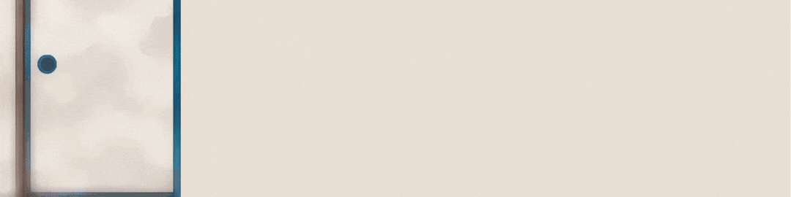

I’m MD Rayhan Talukder a.k.a. , a growing full-stack developer.

<h2> GitHub Stats</h2>

|  |  |
| ---------------------------------------------------------------------------------------------------------------------------------------------------------------------------------------------------------------------------------------------------------------------------------------------------------------------------------------------------------------------------------------------------------------------------------------------------------------------------------------------------------------------------------------------------------------------------------------------------------------------------------------------- | -------------------------------------------------------------------------------------- |

<h2> Skills, Technologies & Tools</h2>

