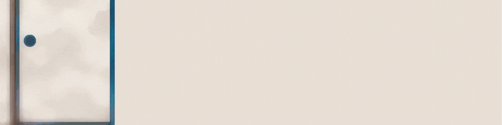

<pre align="center"><strong>sinDbug is Here!</strong></pre>

<h2> Skills, Technologies & Tools</h2>

<h4>Current Stack: </h4>

<h4>Others: </h4>

<h2> GitHub Stats</h2>

|  |  |
| ---------------------------------------------------------------------------------------------------------------------------------------------------------------------------------------------------------------------------------------------------------------------------------------------------------------------------------------------------------------------------------------------------------------------------------------------------------------------------------------------------------------------------------------------------------------------------------------------------------------------------------------------- | -------------------------------------------------------------------------------------- |
